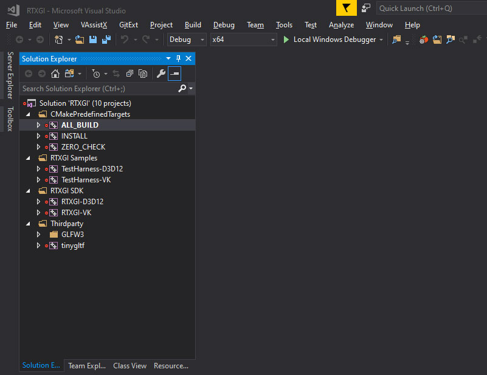
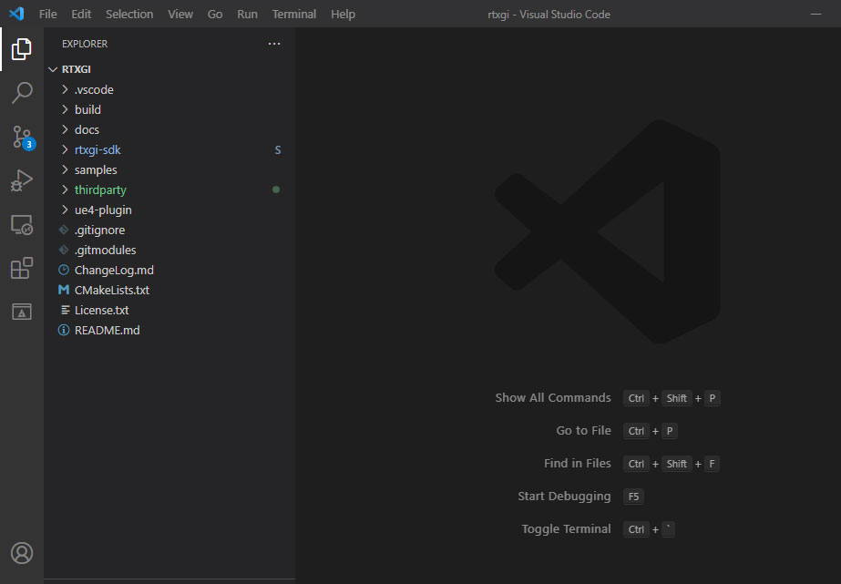
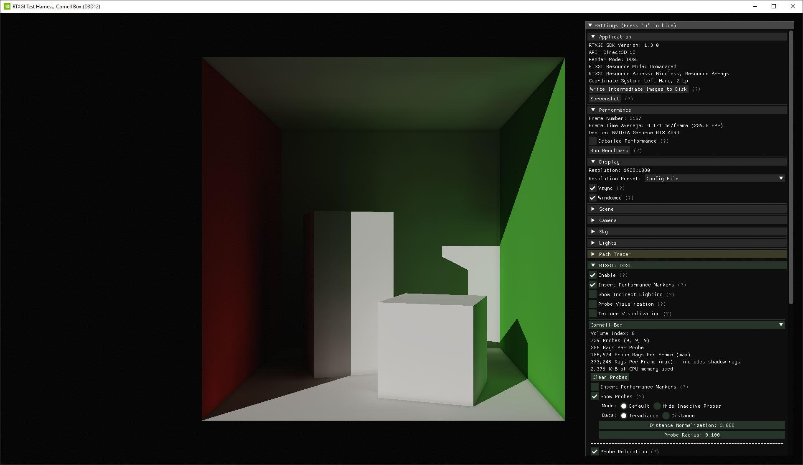

# RTXGI Quick Start

This fastest way to start learning RTXGI is to clone, build, and run the Test Harness sample application provided alongside the SDK.

## Clone the Code and Sample Content

1. Clone the repository (with all submodules)

    `git clone --recursive https://github.com/NVIDIAGameWorks/RTXGI.git`

2. Pull the DirectX Shader Compiler (DXC) binaries from packman

   `update_dependencies.bat` (Windows)

   `update_dependencies.sh` (Linux)

3. Install the [Vulkan SDK](https://vulkan.lunarg.com/sdk/home) (optional on Windows)

4. Clone the Khronos Sponza GLTF content (optional)

     * Clone https://github.com/KhronosGroup/glTF-Sample-Models to somewhere on your machine (but don't clone it inside of this project).

    * Copy or move the contents of https://github.com/KhronosGroup/glTF-Sample-Models/tree/master/2.0/Sponza/glTF into `samples/test-harness/data/gltf/sponza`.

    * See the [Sponza README](../samples/test-harness/data/gltf/sponza/README.md) for more information.

## Configure with CMake

5. Install CMake. The [CMake GUI](https://cmake.org/download/) is convenient and easy to use.

6. Open CMake GUI and fill in the path options.

   * On the *source code* line, fill in the path to where you have cloned this  repository on your machine (e.g. `C:/rtxgi`).
   * On the *build binaries* line, fill in the path to the repository plus */build* (e.g. `C:/rtxgi/build`).

     

7. Click `Configure`
   * If using Visual Studio 2017 on Windows, select `x64` as the platform for the generator in the dropdown.
   * If using Visual Studio 2019 on Windows, the platform is `x64` by default.

8. Click `Generate`
   * The generated Visual Studio project is located in `[path-to-repo]/build/RTXGI.sln` (e.g. `C:/rtxgi/build/RTXGI.sln`).

## Build and Run

### Windows

9. Click `Open Project` in CMake to open the generated Visual Studio solution.

   * **Note:** there are separate projects for the D3D12 and Vulkan versions of the SDK and sample application(s). If the Vulkan SDK is not installed, or you disable Vulkan in the CMake options, the `-VK` projects are not generated.

     

10. Build the solution.

   * **Note:** if you want to just build the RTXGI SDK, uncheck the `RTXGI_BUILD_SAMPLES` option in CMake, click Generate, and reload the Visual Studio solution. The RTXGI Samples and Thirdparty folders will be removed.

11. Set the Startup Project to `TestHarness-D3D12` (or `TestHarness-VK`).

12. Run the Test Harness.

---

### Linux

9. Open Visual Studio Code.

10. Open the folder (```File->Open Folder```) where you cloned the repository (e.g. `C:rtxgi/`)

       * The VSCode [CMake Tools Extension](https://marketplace.visualstudio.com/items?itemName=ms-vscode.cmake-tools) is useful if you want to configure, generate, and build all in VSCode.

         

11. Build the default target.

12. Select `Run->Start without Debugging`

       * This uses the launch arguments in `[path-to-repo]/.vscode/launch.json`

## Enjoy

The Cornell Box scene is loaded by default and you should see the below result:

